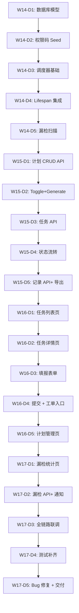

# 3.6 设备巡检 - W14~W17 详细任务分解

> **说明**: 本文件为 `docs/plan/3.6-设备巡检 - 开发计划.md` 的配套文档，将里程碑细化到每日任务项。

---

## 📅 总体时间规划

| 周次 | 周期 | 核心目标 | 交付物 |
|------|------|----------|--------|
| **W14** | Day1~Day5 | 模型设计 + 调度器基础 | 表创建成功、定时任务可手动触发 |
| **W15** | Day1~Day5 | API 全量实现 | CRUD 接口通过 Postman 验证 |
| **W16** | Day1~Day5 | 前端页面开发 | PC 端填报流程跑通 |
| **W17** | Day1~Day3 | 漏检统计 + 联调 | 主管收到预警通知 |
|      | Day4~Day5 | 测试补齐 + Bug 修复 | pytest/vitest 达标 |

---

## 🔥 W14 周任务分解（模型与调度器）

### **Day 1: 数据库模型与设计 (3.6-B1)**

| 时间 | 任务项 | 负责人 | 输出物 | 验收标准 |
|------|--------|--------|--------|----------|
| 09:00-11:00 | 创建 `inspection_plans`/`tasks`/`records` 三个模型文件 | 后端 A | `models/inspection.py` | 符合 PRD 4.2 DDL |
| 11:00-12:00 | 创建对应的 Pydantic Schemas | 后端 A | `schemas/inspection.py` | 包含 request/response 两类 |
| 13:00-15:00 | 编写 Alembic 迁移脚本（自动生成或手写） | 后端 A | `alembic/versions/xxx_inspection.py` | `alembic upgrade head` 无报错 |
| 15:00-17:00 | 插入索引语句（org_id, task_date 等） | 后端 A | 迁移文件中包含 CREATE INDEX | PostgreSQL 中确认索引存在 |

**✅ 当日里程碑**: 数据库三张表 + 索引全部就绪

---

### **Day 2: 权限码 Seed (3.6-B1 续)**

| 时间 | 任务项 | 负责人 | 输出物 | 验收标准 |
|------|--------|--------|--------|----------|
| 09:00-11:00 | 在 `init_data.py` 中增加 `inspection:*` 权限码 | 后端 B | 幂等初始化脚本 | 重复执行不报错 |
| 11:00-12:00 | 分配角色权限矩阵（chief/maintainer/operator） | 后端 B | 权限绑定逻辑 | 三类角色权限正确 |
| 13:00-15:00 | 新增菜单 `inspection:task` 与子菜单映射 | 后端 B | 菜单树配置 | 前端侧边栏可见 |
| 15:00-17:00 | 在数据库验证权限分配（PostgreSQL） | 后端 B | 截图或日志 | `SELECT * FROM role_permissions WHERE perm_id IN (...)` |

**✅ 当日里程碑**: 三类角色权限矩阵生效

---

### **Day 3: 后台任务框架搭建 (3.6-B2)**

| 时间 | 任务项 | 负责人 | 输出物 | 验收标准 |
|------|--------|--------|--------|----------|
| 09:00-11:00 | 创建 `services/inspection_scheduler.py` | 后端 C | Python 文件骨架 | 导入无报错 |
| 11:00-12:00 | 实现 `generate_tasks_for_today()` 函数 | 后端 C | 函数代码 | 按 daily 计划生成今日任务 |
| 13:00-15:00 | 实现周期解析逻辑（daily/weekly/monthly） | 后端 C | `parse_cycle_type()` 函数 | weekly 周一生成，monthly 1 号生成 |
| 15:00-17:00 | 添加唯一约束保护（INSERT ON CONFLICT DO NOTHING） | 后端 C | SQL 语句或 ORM | 同一天只生成一条任务 |

**✅ 当日里程碑**: 单日周期任务生成功能可用

---

### **Day 4: 后台任务集成到 Lifespan (3.6-B2 续)**

| 时间 | 任务项 | 负责人 | 输出物 | 验收标准 |
|------|--------|--------|--------|----------|
| 09:00-11:00 | 在 `app/main.py` lifespan 事件中注册 `asyncio.create_task()` | 后端 C | `lifespan` 事件代码 | FastAPI 启动时自动运行 |
| 11:00-12:00 | 实现每日 00:05 定时检查（用 `asyncio` 睡眠循环或 APScheduler） | 后端 C | 定时调度逻辑 | 次日 00:05 分自动生成任务 |
| 13:00-15:00 | 支持手动触发立即生成任务（`POST /inspection-plans/{id}/generate`） | 后端 C | API endpoint | 调用后立即看到今日任务 |
| 15:00-17:00 | 单元测试：`test_inspection_scheduler.py` Day1 版本 | 后端 D | pytest 测试文件 | 5 条测试通过 |

**✅ 当日里程碑**: 自动 + 手动双重触发可用

---

### **Day 5: 后台任务边界条件测试 (3.6-B3)**

| 时间 | 任务项 | 负责人 | 输出物 | 验收标准 |
|------|--------|--------|--------|----------|
| 09:00-11:00 | 实现漏检扫描逻辑（扫描昨日 pending 任务） | 后端 C | `scan_missed_tasks()` 函数 | 昨日未完成 → status='missed' |
| 11:00-12:00 | 实现漏检计数 + 超过 3 次发送系统内通知 | 后端 C | `notify_supervisor_if_threshold_exceeded()` | 通知中心显示红点 |
| 13:00-15:00 | 测试：模拟历史数据（插入 4 条 missed） | 后端 D | pytest fixture | 主管收到通知 |
| 15:00-17:00 | 记录问题并修复（如多 worker 重复执行） | 后端 C | 会话记录 | 有兜底策略（唯一约束） |

**✅ W14 周里程碑**: 所有后台任务功能完成，测试覆盖率 ≥80%

---

## 🚀 W15 周任务分解（API 全量实现）

### **Day 1: 巡检计划 CRUD API (3.6-B4)**

| 时间 | 任务项 | 负责人 | 输出物 | 验收标准 |
|------|--------|--------|--------|----------|
| 09:00-11:00 | 创建 `api/v1/inspection_plans.py` | 后端 E | Router 文件 | OpenAPI `/api/v1/inspection-plans` 可见 |
| 11:00-12:00 | 实现 GET /list + 分页 + 筛选 | 后端 E | `get_plan_list()` | 支持 page/page_size/org_id 筛选 |
| 13:00-15:00 | 实现 POST/create + PUT/update + DELETE | 后端 E | CRUD endpoints | 创建后查得到，更新后改得对 |
| 15:00-17:00 | 权限验证：`Depends(require_permission("inspection:view"))` | 后端 E | Depends 装饰器 | 未授权用户返回 403 |

**✅ 当日里程碑**: 计划 CRUD 全绿

---

### **Day 2: 计划启用/停用 + 手动生成 (3.6-B4 续)**

| 时间 | 任务项 | 负责人 | 输出物 | 验收标准 |
|------|--------|--------|--------|----------|
| 09:00-11:00 | 实现 `POST /{id}/toggle` (启用/停用) | 后端 E | Toggle endpoint | is_enabled 字段正确翻转 |
| 11:00-12:00 | 实现 `POST /{id}/generate` (手动生成今日任务) | 后端 E | Generate endpoint | 调用后 inspection_tasks 插入一行 |
| 13:00-15:00 | 数据范围过滤：按 org_id 限制可见列表 | 后端 E | 查询中的 org_id 过滤 | self 用户只能看自己创建的 |
| 15:00-17:00 | 单元测试 + Postman Collection 导出 | 后端 D/E | 自动化测试 + 集合文件 | 10 个测试用例全部通过 |

**✅ 当日里程碑**: 计划模块完整 API 可用

---

### **Day 3: 巡检任务 API (3.6-B5)**

| 时间 | 任务项 | 负责人 | 输出物 | 验收标准 |
|------|--------|--------|--------|----------|
| 09:00-11:00 | 创建 `api/v1/inspection_tasks.py` | 后端 F | Router 文件 | OpenAPI 路径可见 |
| 11:00-12:00 | 实现 GET /list（我的任务 + 全部视角） | 后端 F | 列表端点 | 支持 status/date_range 筛选 |
| 13:00-15:00 | 实现 GET /{id}（详情 + 含设备清单） | 后端 F | 详情端点 | 返回关联的所有设备 ID |
| 15:00-17:00 | 实现 POST /{id}/records（提交巡检记录） | 后端 F | 记录端点 | 照片上传 URL 存入 JSONB |

**✅ 当日里程碑**: 任务列表 + 填报可用

---

### **Day 4: 任务手动完成 + 状态流转 (3.6-B5 续)**

| 时间 | 任务项 | 负责人 | 输出物 | 验收标准 |
|------|--------|--------|--------|----------|
| 09:00-11:00 | 实现 `POST /{id}/complete`（手动标记完成） | 后端 F | Complete endpoint | status 从 doing→completed |
| 11:00-12:00 | 自动状态流转：部分填报 → doing；全部完成 → completed | 后端 F | Service 层逻辑 | 第一次填报 → doing |
| 13:00-15:00 | 异常拍照上传：复用 3.3 文件上传组件 | 后端 F | multipart/form-data 处理 | 单张≤10MB，最多 9 张 |
| 15:00-17:00 | 单元测试覆盖状态流转边界条件 | 后端 D | pytest 测试 | edge cases 全部通过 |

**✅ 当日里程碑**: 任务状态流转闭环

---

### **Day 5: 巡检记录 API + 导出 (3.6-B5 续)**

| 时间 | 任务项 | 负责人 | 输出物 | 验收标准 |
|------|--------|--------|--------|----------|
| 09:00-11:00 | 创建 `api/v1/inspection_records.py` | 后端 G | Router 文件 | OpenAPI 路径可见 |
| 11:00-12:00 | 实现 GET /list（按 device/result/时间筛选） | 后端 G | 列表端点 | 三个筛选条件都有效 |
| 13:00-15:00 | 实现 GET /export（同步导出 ≤1 万行） | 后端 G | CSV/XLSX 导出 | 导出发送 stream，不 OOM |
| 15:00-17:00 | 数据范围过滤 + 单元测试 | 后端 D/G | 测试文件 | 权限过滤验证通过 |

**✅ W15 周里程碑**: 所有 API 端点开发完成，Postman Collection 导出

---

## 💻 W16 周任务分解（前端页面开发）

### **Day 1: 巡检任务页 - 列表展示 (3.6-F1)**

| 时间 | 任务项 | 负责人 | 输出物 | 验收标准 |
|------|--------|--------|--------|----------|
| 09:00-11:00 | 重写 `views/inspection/Task.vue` 骨架 | 前端 H | Vue 组件 | 侧边栏可见菜单入口 |
| 11:00-12:00 | 集成 Element Plus 表格 + 分页 | 前端 H | TaskList.vue | 前端调用 `/inspection-tasks` |
| 13:00-15:00 | 实现状态标签（pending/doing/completed/missed） | 前端 H | 状态渲染逻辑 | 四种颜色正确区分 |
| 15:00-17:00 | 实现日期筛选 + 责任人筛选下拉框 | 前端 H | 表单筛选组件 | 筛选后列表刷新 |

**✅ 当日里程碑**: 任务列表页可浏览

---

### **Day 2: 任务详情 + 点击跳转 (3.6-F1 续)**

| 时间 | 任务项 | 负责人 | 输出物 | 验收标准 |
|------|--------|--------|--------|----------|
| 09:00-11:00 | 创建 `views/inspection/TaskDetail.vue` | 前端 I | 详情页组件 | Tab 切换：基本信息 / 设备清单 |
| 11:00-12:00 | 加载任务详情 + 设备列表（分页） | 前端 I | API 调用封装 | 设备列表展示前 20 条 |
| 13:00-15:00 | "点击设备名称"跳转到填报页 | 前端 I | router-link | 携带 device_id 参数 |
| 15:00-17:00 | 前端单元测试：TaskList 组件渲染 | 前端 J | Vitest 测试 | 2 条用例通过 |

**✅ 当日里程碑**: 任务列表 → 详情 → 设备点击进入路径打通

---

### **Day 3: 巡检填报页 - 表单基础 (3.6-F2)**

| 时间 | 任务项 | 负责人 | 输出物 | 验收标准 |
|------|--------|--------|--------|----------|
| 09:00-11:00 | 设计表单布局：设备信息 + 结果单选 + 描述文本域 | 前端 K | Form 结构 | 界面整洁易用 |
| 11:00-12:00 | 实现正常/异常结果切换（radio 按钮） | 前端 K | Radio 组 | 选中后变色提示 |
| 13:00-15:00 | 异常描述必填校验（当 result='abnormal'） | 前端 K | 表单验证规则 | 未填写无法提交 |
| 15:00-17:00 | 照片上传组件（Element Plus ElUpload） | 前端 K | Upload 组件 | 预览 + 删除功能可用 |

**✅ 当日里程碑**: 填报表单可填写并可上传照片

---

### **Day 4: 填报提交 + 反馈 (3.6-F2 续)**

| 时间 | 任务项 | 负责人 | 输出物 | 验收标准 |
|------|--------|--------|--------|----------|
| 09:00-11:00 | 调用 `POST /inspection-tasks/{id}/records` | 前端 K | API 封装 | 成功后返回 200 |
| 11:00-12:00 | 提交成功 → 提示 + 返回列表页 | 前端 K | ElMessage 提示 | 用户友好提示 |
| 13:00-15:00 | 异常时显示"创建维修工单"快捷按钮 | 前端 K | 条件渲染按钮 | 跳转至 3.7 工单页 |
| 15:00-17:00 | 前端单元测试：TaskDetail 填报交互 | 前端 J | Vitest 测试 | 2 条用例通过（正常/异常切换） |

**✅ 当日里程碑**: 全流程填报可提交并看到后续入口

---

### **Day 5: 巡检计划页 (3.6-F3)**

| 时间 | 任务项 | 负责人 | 输出物 | 验收标准 |
|------|--------|--------|--------|----------|
| 09:00-11:00 | 创建 `views/inspection/Plan.vue` | 前端 L | CRUD 页面骨架 | 表格 + 弹窗表单 |
| 11:00-12:00 | 周期类型选择器（dropdown） + 区域选择 | 前端 L | Form 组件 | 下拉框正确回显 |
| 13:00-15:00 | 启用/停用开关 + 手动立即生成任务按钮 | 前端 L | Toggle + Button | 点击生效 |
| 15:00-17:00 | 前端单元测试：Plan CRUD 交互 | 前端 J | Vitest 测试 | 2 条用例通过 |

**✅ W16 周里程碑**: 三大前端页面（任务/填报/计划）全部上线

---

## 🎉 W17 周任务分解（收尾与验收）

### **Day 1: 漏检统计页 (3.6-F5)**

| 时间 | 任务项 | 负责人 | 输出物 | 验收标准 |
|------|--------|--------|--------|----------|
| 09:00-11:00 | 创建 `views/inspection/MissedStats.vue` | 前端 M | 统计表首页 | 列出责任人 + 漏检次数 |
| 11:00-12:00 | 调用 `/inspection-missed-stats` API | 前端 M | API 调用 | 数据正确展示 |
| 13:00-15:00 | 主管视角下钻：按区域查看 | 前端 M | 下钻图表 | 点击某区域展开该区域漏检 |
| 15:00-17:00 | 前端单元测试（如有需要） | 前端 J | Vitest 测试 | 1 条用例通过 |

**✅ 当日里程碑**: 漏检统计页面可用

---

### **Day 2: 漏检统计 API + 通知集成 (3.6-B6)**

| 时间 | 任务项 | 负责人 | 输出物 | 验收标准 |
|------|--------|--------|--------|----------|
| 09:00-11:00 | 实现 `GET /inspection-missed-stats` API | 后端 N | 聚合查询 API | 按责任人/区域分组统计 |
| 11:00-12:00 | 集成 3.5 通知中心：漏检 >3 次发通知 | 后端 N | Notification 调用 | 系统内通知显示 |
| 13:00-15:00 | 前端联动：右上角通知铃铛显示新消息 | 前端 M | WebSocket/轮询 | 红点跳动提示 |
| 15:00-17:00 | 联调测试：模拟漏检场景 → 主管收到通知 | 后端+N+ 前端 | 端到端测试 | 完整流程跑通 |

**✅ 当日里程碑**: 漏检预警全流程打通

---

### **Day 3: 前后端全链路联调**

| 时间 | 任务项 | 负责人 | 输出物 | 验收标准 |
|------|--------|--------|--------|----------|
| 09:00-11:00 | 每日任务生成：真实 PostgreSQL 环境验证 | 后端+C+ 前端 | 真实容器环境 | 凌晨 00:05 自动产生今日任务 |
| 11:00-12:00 | 填报闭环：维保人员填报 abnormal → 创建工单入口 | 前端+K 后端 | 端到端测试 | 跳转正确，参数携带无误 |
| 13:00-15:00 | 权限矩阵验证：三类角色访问控制抽样 | 测试+O | 人工测试报告 | 值班员 403，维保人员部分权限，主管全部 |
| 15:00-17:00 | 性能验证：1000+ 设备场景下填报流畅度 | 测试+P | 压测记录 | 前端加载 <2 秒，提交 <1 秒 |

**✅ 当日里程碑**: 全链路联调通过，无阻塞级 Bug

---

### **Day 4: 测试补齐（pytest + vitest）**

| 时间 | 任务项 | 负责人 | 输出物 | 验收标准 |
|------|--------|--------|--------|----------|
| 09:00-11:00 | 后端：`test_inspection_permission.py` 9 条用例 | 后端 D | pytest 测试 | 全部通过 |
| 11:00-12:00 | 后端：`test_inspection_scheduler.py` 漏检扫描测试 | 后端 D | pytest 测试 | 4 条用例通过 |
| 13:00-15:00 | 前端：`__tests__/` 目录补充 3 个组件测试 | 前端 J | Vitest 测试 | 6 条用例全部通过 |
| 15:00-17:00 | 汇总测试报告：覆盖率计算 | 测试+Q | 覆盖率报告 | 前端 ≥80%，后端 ≥75% |

**✅ 当日里程碑**: 测试覆盖率达标（前端≥80%，后端≥75%）

---

### **Day 5: Bug 修复 + 文档完善 + 交付**

| 时间 | 任务项 | 负责人 | 输出物 | 验收标准 |
|------|--------|--------|--------|----------|
| 09:00-11:00 | Bug 修复：集中修复测试发现的问题 | 后端+C+ 前端 | Git commit | 无阻塞级 Bug 遗留 |
| 11:00-12:00 | 文档完善：更新 `实现偏离` 章节（计划第 15 节） | 项目经理 R | Markdown 文档 | 实际 vs 计划对比清晰 |
| 13:00-15:00 | 编写 MANUAL TESTING GUIDE（类似 3.5 的手册） | 测试+O | 测试手册 | 可指导 QA 独立验证 |
| 15:00-17:00 | 最终验收会议：演示 + Q&A | 全体 | 验收签字 | 客户/产品经理确认通过 |

**✅ W17 周里程碑（及 3.6 整体交付）**: 满足 PRD 3.6 所有章节要求，可进入 UAT 阶段！

---

## 📊 关键路径与依赖图

---

## ⚠️ 风险预警与应对

| 风险 | 可能性 | 影响 | 应对措施 | 责任人 |
|------|--------|------|----------|--------|
| **数据库迁移失败** | 低 | 高 | 本地 PostgreSQL 先试，备好回滚脚本 | 后端 A |
| **多 worker 重复生成任务** | 中 | 中 | 依赖唯一约束兜底，监控日志 | 后端 C |
| **前端组件库兼容性** | 低 | 中 | Vitest + overlayStub 方案已知可行 | 前端 J |
| **漏检阈值配置争议** | 低 | 低 | 首版硬编码，后续 3.10 再开放 | 项目经理 R |

---

*文档版本：v1.0；基于 `3.6-设备巡检 - 开发计划.md` 第九节里程碑细化。*
